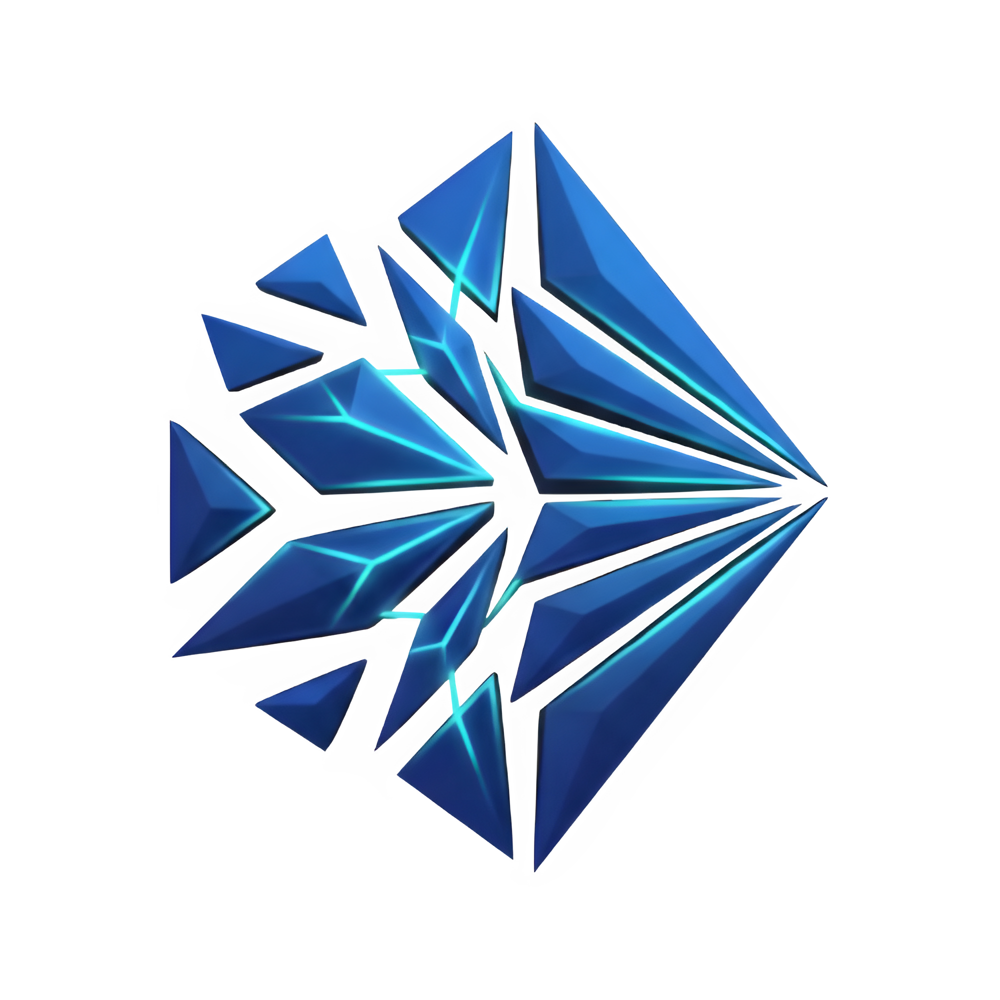

# DeepFract: AI-Enhanced Fractal Image Compression



DeepFract is an advanced image compression architecture bridging classic mathematical self-similarity principles with deep-learning synthesis logic gracefully.

---

## The Complete AI Pipeline Guide

Imagine you are trying to recreate a large printed photograph using cut-up paper pieces.

### The 5 Fundamental Techniques

#### 1. Manual Fractal Matching (IFS - Iterated Function Systems)
* **What it does:** Finding repeated patterns by testing every option.
* **The Analogy:** Looking at every small square piece of paper and trying to find the perfect matching color on a giant poster manually. 
* **The Downside:** Takes far too much time.

#### 2. Fractal Pattern Predictor (CNN - Convolutional Neural Networks)
* **What it does:** Using baseline AI filters to find patterns quickly.
* **The Analogy:** An automatic sorter grabs the square pieces and puts them into rough piles by color. 
* **The Downside:** It gets clumsy and blends the colors together, making the final picture blurry.

#### 3. Structural Fractal Focus (ResNet - Residual Networks)
* **What it does:** Advanced structural alignment calculations.
* **The Analogy:** The machine successfully aligns the photo pieces correctly onto the paper. 
* **The Downside:** Once glued down, you can still clearly see the thin square cut lines between the pieces.

#### 4. Adaptive Fractal Sizing (Quadtree Decomposition)
* **What it does:** Splitting simple areas from complex areas to save memory.
* **The Analogy:** Leaving simple areas (like sky) as huge paper squares, but cutting busy areas (like eyes) into tiny ones. 
* **The Downside:** The jump between massive squares and tiny squares makes the cut lines look even harsher.

#### 5. Final Fractal Error Eraser (CBAM: Convolutional Block Attention Module & AG-UNet: Attention Gate U-Net Post-Processor)
* **What it does:** A generative AI network that removes digital noise.
* **The Analogy:** Taking a special blending marker and painting over the borders to remove the seams completely.
* **The Downside:** Demands strong computer RAM to execute.

---

## The "Orchestra" Framework

Instead of letting individual downsides block compression, the system uses the **"Orchestra" approach** to combine all benefits synchronously:

1. **Adaptive Quadtree** shrinks heavy details without wasting space.
2. **ResNet mappings** resolve coordinate variables instantly.
3. **CBAM AG-UNet filters** hide the borders successfully, resulting in a single high-fidelity image.

---

## Local Deployments

### Server Configuration

```bash
cd backend
pip install -r requirements.txt
python manage.py runserver
```

### Mobile Compilations

```bash
cd frontend
flutter pub get
flutter run
```

