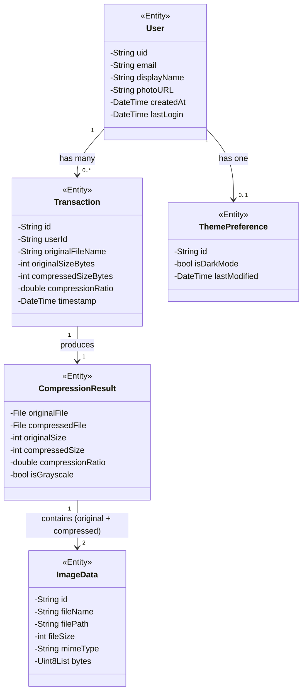
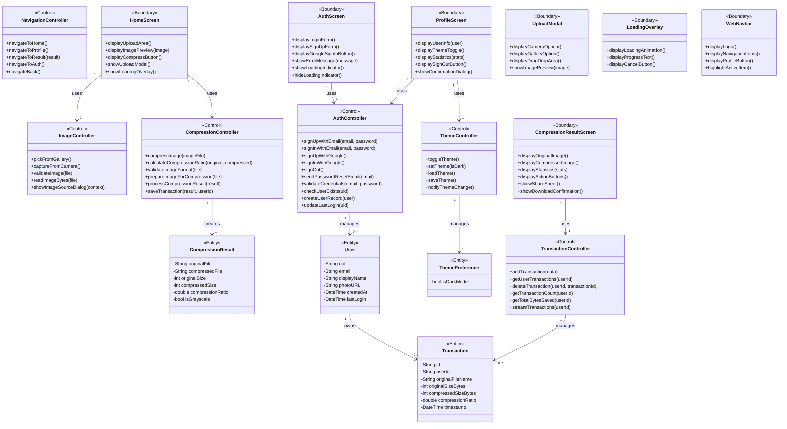
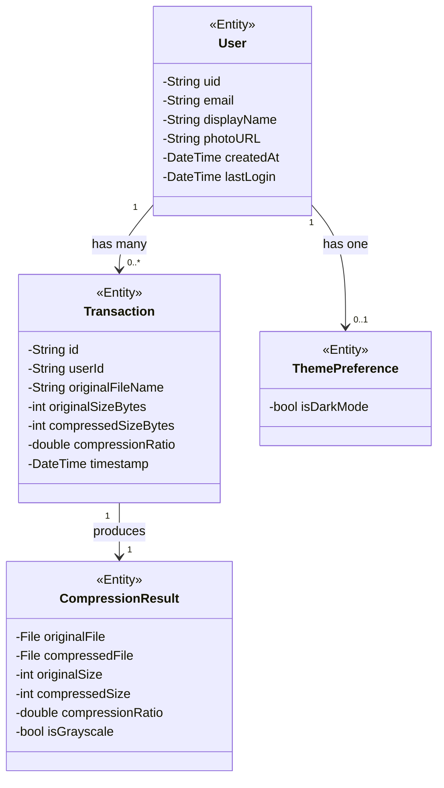
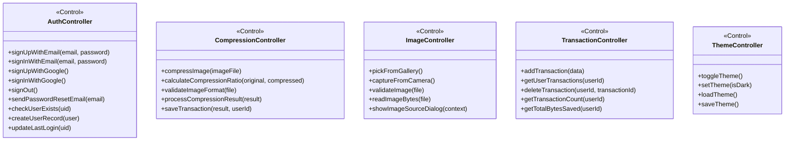
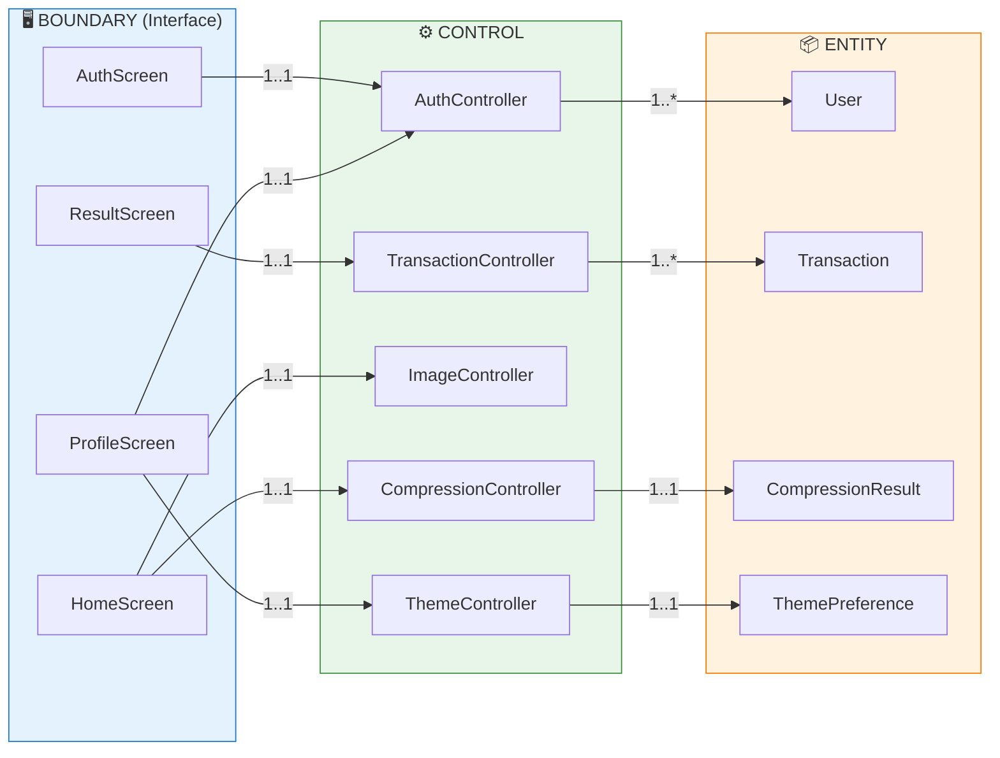

# DeepFract - Class Diagram & Analysis Classes

> **Project:** DeepFract - AI-Powered Fractal Image Compression  
> **Version:** 1.0  
> **Date:** December 2024

---

## Table of Contents

1. [Class Diagram (Entity Classes - Attributes Only)](#class-diagram-entity-classes)
2. [Analysis Class Diagram (BCE Pattern)](#analysis-class-diagram)
3. [Entity Classes](#entity-classes)
4. [Control Classes](#control-classes)
5. [Boundary/Interface Classes](#boundaryinterface-classes)
6. [Class Relationships](#class-relationships)

---

## Class Diagram (Entity Classes)

> **Note:** This diagram shows only **attributes** (no methods) - suitable for Object-Oriented Database design.

---

## Entity Classes - Attributes Table

### User Entity

| Attribute | Data Type | Constraints | Description |
|-----------|-----------|-------------|-------------|
| `uid` | String | PK, NOT NULL | Firebase Auth unique identifier |
| `email` | String | NOT NULL, UNIQUE | User email address |
| `displayName` | String | NULLABLE | User display name |
| `photoURL` | String | NULLABLE | Profile photo URL |
| `createdAt` | DateTime | NOT NULL | Account creation timestamp |
| `lastLogin` | DateTime | NOT NULL | Last login timestamp |

### Transaction Entity

| Attribute | Data Type | Constraints | Description |
|-----------|-----------|-------------|-------------|
| `id` | String | PK, NOT NULL | Auto-generated document ID |
| `userId` | String | FK, NOT NULL | Reference to User.uid |
| `originalFileName` | String | NOT NULL | Original image filename |
| `originalSizeBytes` | int | NOT NULL, >= 0 | Size before compression |
| `compressedSizeBytes` | int | NOT NULL, >= 0 | Size after compression |
| `compressionRatio` | double | NOT NULL, 0-100 | Compression percentage |
| `timestamp` | DateTime | NOT NULL | When compression occurred |

### CompressionResult Entity

| Attribute | Data Type | Constraints | Description |
|-----------|-----------|-------------|-------------|
| `originalFile` | File | NOT NULL | Original image file |
| `compressedFile` | File | NOT NULL | Compressed image file |
| `originalSize` | int | NOT NULL | Original size in bytes |
| `compressedSize` | int | NOT NULL | Compressed size in bytes |
| `compressionRatio` | double | NOT NULL | Ratio percentage |
| `isGrayscale` | bool | NOT NULL | Whether output is grayscale |

### ThemePreference Entity

| Attribute | Data Type | Constraints | Description |
|-----------|-----------|-------------|-------------|
| `id` | String | PK | User identifier |
| `isDarkMode` | bool | NOT NULL | Theme preference |
| `lastModified` | DateTime | NOT NULL | Last change timestamp |

### ImageData Entity

| Attribute | Data Type | Constraints | Description |
|-----------|-----------|-------------|-------------|
| `id` | String | PK | Unique identifier |
| `fileName` | String | NOT NULL | File name |
| `filePath` | String | NULLABLE | File system path |
| `fileSize` | int | NOT NULL | Size in bytes |
| `mimeType` | String | NOT NULL | MIME type (image/jpeg, etc.) |
| `bytes` | Uint8List | NULLABLE | Raw image bytes |

---

## Analysis Class Diagram

> **BCE Pattern:** Boundary (Interface), Control, Entity classes

---

## Entity Classes

> **Purpose:** Represent data objects stored in the database. Contains only attributes.

---

## Control Classes

> **Purpose:** Contain business logic and methods. Process requests from Boundary classes and manipulate Entity classes.

### Control Classes - Methods Table

| Controller | Method | Parameters | Return | Description |
|------------|--------|------------|--------|-------------|
| **AuthController** | signUpWithEmail | email, password | UserCredential | Create new account |
| | signInWithEmail | email, password | UserCredential | Authenticate user |
| | signUpWithGoogle | - | UserCredential? | Google OAuth sign-up |
| | signInWithGoogle | - | UserCredential? | Google OAuth sign-in |
| | signOut | - | void | End session |
| | checkUserExists | uid | bool | Verify user in database |
| **CompressionController** | compressImage | File | CompressionResult | Compress image |
| | calculateCompressionRatio | int, int | double | Calculate ratio |
| | saveTransaction | result, userId | void | Store record |
| **ImageController** | pickFromGallery | - | File? | Select from gallery |
| | captureFromCamera | - | File? | Take photo |
| **TransactionController** | addTransaction | data | String | Add new record |
| | getUserTransactions | userId | List | Get history |
| | getTotalBytesSaved | userId | int | Calculate savings |
| **ThemeController** | toggleTheme | - | void | Switch theme |
| | loadTheme | - | void | Load saved preference |
| | saveTheme | - | void | Persist preference |

---

## Boundary/Interface Classes

> **Purpose:** Handle user interaction. Display data and capture user input. Communicate with Control classes.

```mermaid
classDiagram
    class AuthScreen {
        <<Boundary>>
        +displayLoginForm()
        +displaySignUpForm()
        +displayGoogleSignInButton()
        +showErrorMessage(message)
        +showLoadingIndicator()
    }

    class HomeScreen {
        <<Boundary>>
        +displayUploadArea()
        +displayImagePreview(image)
        +displayCompressButton()
        +showUploadModal()
        +showLoadingOverlay()
    }

    class CompressionResultScreen {
        <<Boundary>>
        +displayOriginalImage()
        +displayCompressedImage()
        +displayStatistics(stats)
        +displayActionButtons()
        +showShareSheet()
    }

    class ProfileScreen {
        <<Boundary>>
        +displayUserInfo(user)
        +displayThemeToggle()
        +displayStatistics(stats)
        +displaySignOutButton()
    }

    class UploadModal {
        <<Boundary>>
        +displayCameraOption()
        +displayGalleryOption()
        +showImagePreview(image)
    }

    class LoadingOverlay {
        <<Boundary>>
        +displayLoadingAnimation()
        +displayProgressText()
    }

    class WebNavbar {
        <<Boundary>>
        +displayNavigationItems()
        +displayProfileButton()
    }
```

### Boundary Classes - Interface Methods Table

| Screen | Method | Description |
|--------|--------|-------------|
| **AuthScreen** | displayLoginForm() | Render login form with email/password fields |
| | displaySignUpForm() | Render sign-up form with confirmation |
| | displayGoogleSignInButton() | Show Google OAuth button |
| | showErrorMessage(msg) | Display error feedback |
| | showLoadingIndicator() | Show progress spinner |
| **HomeScreen** | displayUploadArea() | Show image upload zone |
| | displayImagePreview(img) | Preview selected image |
| | displayCompressButton() | Show compression action button |
| | showUploadModal() | Open source selection dialog |
| **CompressionResultScreen** | displayOriginalImage() | Show before image |
| | displayCompressedImage() | Show after image |
| | displayStatistics(stats) | Show compression metrics |
| | showShareSheet() | Open platform share dialog |
| **ProfileScreen** | displayUserInfo(user) | Show user details |
| | displayThemeToggle() | Show dark/light switch |
| | displaySignOutButton() | Show logout option |

---

## Class Relationships

### BCE Interaction Diagram

---

## Mapping to Codebase

| Analysis Class | Code Implementation | File |
|----------------|---------------------|------|
| **AuthController** | AuthService | `lib/services/auth_service.dart` |
| **CompressionController** | CompressionService | `lib/services/compression_service.dart` |
| **ImageController** | ImagePickerService | `lib/services/image_picker_service.dart` |
| **TransactionController** | TransactionService | `lib/services/transaction_service.dart` |
| **ThemeController** | ThemeProvider | `lib/utils/theme_provider.dart` |
| **User** | Firebase User + Firestore doc | Firestore `users` collection |
| **Transaction** | UserTransaction | `lib/models/user_transaction.dart` |
| **CompressionResult** | CompressionResult | `lib/services/compression_service.dart` |
| **AuthScreen** | AuthScreen | `lib/screens/auth_screen.dart` |
| **HomeScreen** | HomeScreen | `lib/screens/home_screen.dart` |
| **ResultScreen** | CompressionResultScreen | `lib/screens/compression_result_screen.dart` |
| **ProfileScreen** | ProfileScreen | `lib/screens/profile_screen.dart` |

---

*Document generated from DeepFract codebase analysis - December 2024*
