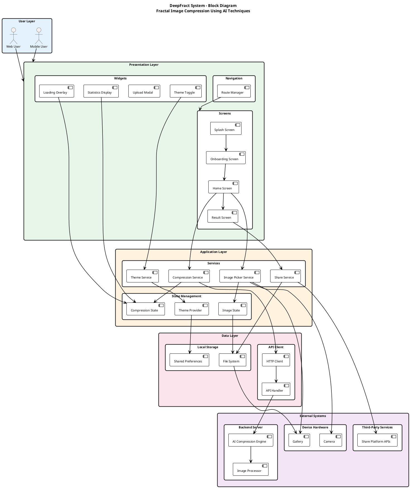
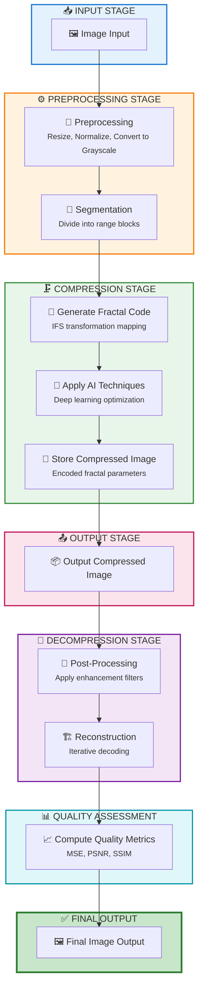
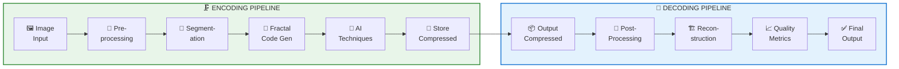
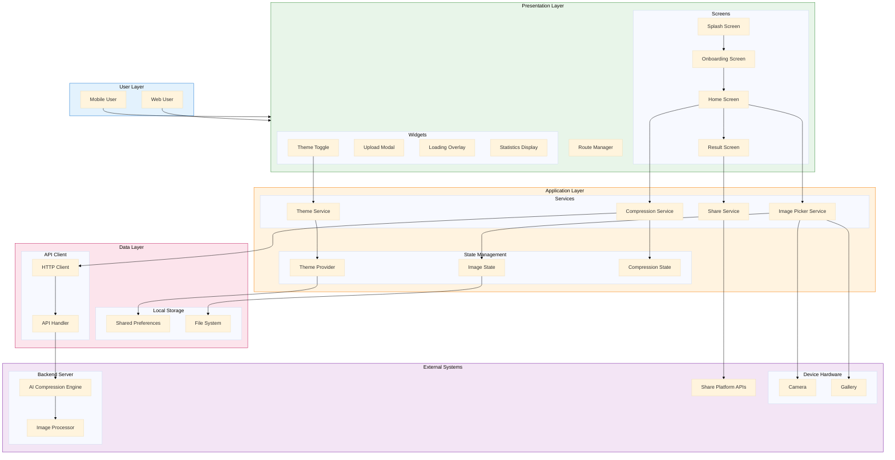
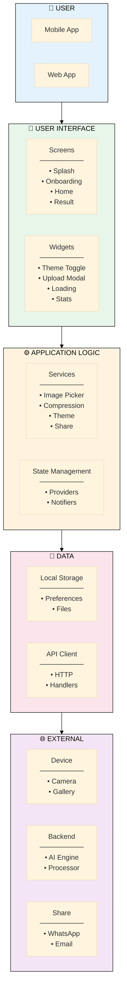

# DeepFract - Block Diagram

## Fractal Image Compression Application Using AI Techniques

### Graduation Project - System Architecture

---

## PlantUML Block Diagram (Academic Format)



---

## Compression Pipeline Block Diagram

The following diagram illustrates the AI-powered fractal image compression pipeline:



### Compression Pipeline - Horizontal View



### Compression Pipeline Stages

| Stage | Component | Description | Output |
|-------|-----------|-------------|--------|
| **Input** | Image Input | User selects image from gallery or camera | Raw image data |
| **Preprocessing** | Preprocessing | Resize, normalize, convert to grayscale | Normalized grayscale image |
| | Segmentation | Divide image into non-overlapping range blocks | Block matrix |
| **Compression** | Generate Fractal Code | Create IFS (Iterated Function System) transformations | Affine transformations |
| | Apply AI Techniques | Use deep learning to optimize block matching | Optimized parameters |
| | Store Compressed | Save encoded fractal parameters | Compressed file (.frc) |
| **Output** | Output Compressed | Provide compressed file to user | Downloadable file |
| **Decompression** | Post-Processing | Apply enhancement filters | Enhanced blocks |
| | Reconstruction | Iteratively decode using fractal parameters | Reconstructed image |
| **Quality** | Compute Metrics | Calculate MSE, PSNR, SSIM scores | Quality report |
| **Final** | Final Output | Deliver reconstructed image | Final image |

### Key Algorithms

| Algorithm | Purpose | Technique |
|-----------|---------|-----------|
| **Block Partitioning** | Divide image into blocks | Quadtree decomposition |
| **Domain-Range Matching** | Find self-similar patterns | Contractive affine transformations |
| **AI Optimization** | Improve matching accuracy | CNN/Deep learning |
| **Iterative Decoding** | Reconstruct image | Fixed-point iteration |

---

## Mermaid Block Diagram



---

## Simplified Block Diagram



---

## Layer Description Table

| Layer                  | Components                            | Responsibility                             |
| ---------------------- | ------------------------------------- | ------------------------------------------ |
| **User Layer**         | Mobile User, Web User                 | End-users interacting with the application |
| **Presentation Layer** | Screens, Widgets, Navigation          | UI rendering and user interaction handling |
| **Application Layer**  | Services, State Management            | Business logic and application state       |
| **Data Layer**         | Local Storage, API Client             | Data persistence and network communication |
| **External Systems**   | Device Hardware, Backend, Third-Party | External integrations and services         |

---

## Component Description Table

### Presentation Layer Components

| Component          | Description                                        |
| ------------------ | -------------------------------------------------- |
| Splash Screen      | Initial branding display with animation            |
| Onboarding Screen  | User introduction tutorial (3 screens)             |
| Home Screen        | Main interface for image selection and compression |
| Result Screen      | Compressed image display with statistics           |
| Theme Toggle       | Light/Dark mode switch widget                      |
| Upload Modal       | Image source selection dialog                      |
| Loading Overlay    | Progress indicator during compression              |
| Statistics Display | Compression ratio and metrics display              |
| Route Manager      | Navigation controller for screen transitions       |

### Application Layer Components

| Component            | Description                                  |
| -------------------- | -------------------------------------------- |
| Image Picker Service | Handles camera and gallery image acquisition |
| Compression Service  | Manages image compression workflow           |
| Theme Service        | Controls application theme state             |
| Share Service        | Handles image sharing to external apps       |
| Theme Provider       | State notifier for theme changes             |
| Image State          | Current selected image state                 |
| Compression State    | Compression progress and result state        |

### Data Layer Components

| Component          | Description                            |
| ------------------ | -------------------------------------- |
| Shared Preferences | Key-value storage for user preferences |
| File System        | Local file storage for images          |
| HTTP Client        | Network request handler                |
| API Handler        | Backend API communication manager      |

### External System Components

| Component             | Description                            |
| --------------------- | -------------------------------------- |
| Camera                | Device camera hardware interface       |
| Gallery               | Device image gallery access            |
| AI Compression Engine | Backend fractal compression algorithm  |
| Image Processor       | Image preprocessing and postprocessing |
| Share Platform APIs   | WhatsApp, Email, social media APIs     |

---

## Data Flow Between Layers

```
┌─────────────────────────────────────────────────────────────────┐
│                         USER LAYER                              │
│                   Mobile User ←→ Web User                       │
└─────────────────────────────┬───────────────────────────────────┘
                              │ User Input / UI Display
                              ▼
┌─────────────────────────────────────────────────────────────────┐
│                    PRESENTATION LAYER                           │
│         Screens ←→ Widgets ←→ Route Manager                     │
└─────────────────────────────┬───────────────────────────────────┘
                              │ Events / State Updates
                              ▼
┌─────────────────────────────────────────────────────────────────┐
│                    APPLICATION LAYER                            │
│              Services ←→ State Management                       │
└─────────────────────────────┬───────────────────────────────────┘
                              │ Data Operations
                              ▼
┌─────────────────────────────────────────────────────────────────┐
│                       DATA LAYER                                │
│            Local Storage ←→ API Client                          │
└─────────────────────────────┬───────────────────────────────────┘
                              │ I/O Operations
                              ▼
┌─────────────────────────────────────────────────────────────────┐
│                    EXTERNAL SYSTEMS                             │
│      Device Hardware ←→ Backend Server ←→ Third-Party           │
└─────────────────────────────────────────────────────────────────┘
```

---

## How to Generate

### PlantUML:

1. Go to **http://www.plantuml.com/plantuml/uml/**
2. Paste the PlantUML code
3. Download as PNG/SVG

### Draw.io:

1. **Arrange → Insert → Advanced → Mermaid**
2. Paste the Mermaid code
3. Click **Insert**
